# 剧工厂企业级智能体平台 - 总体架构设计

## 1. 架构概述

### 1.1 设计原则
基于多语言架构技术预研结果，采用以下核心设计原则：

- **业务驱动**：以影视制作业务需求为核心驱动架构设计
- **多语言优势**：Java企业级微服务 + Python AIGC + 开源工作流引擎
- **技术先进**：采用成熟稳定的先进技术栈，发挥各语言优势
- **高可用性**：确保系统7×24小时稳定运行
- **可扩展性**：支持业务快速增长和技术演进
- **安全性**：多层次安全防护，保护数据和知识产权
- **可维护性**：模块化设计，便于维护和升级
- **性能优化**：关键路径使用最适合的技术栈

### 1.2 架构目标
- **性能目标**：支持1000+并发用户，API响应时间<500ms
- **可用性目标**：系统可用性99.9%以上
- **扩展性目标**：支持水平扩展，支持多租户
- **安全目标**：符合等保三级要求，支持数据脱敏
- **成本目标**：优化资源使用，控制运营成本

### 1.3 多语言技术选型
基于多语言架构预研结果，确定以下核心技术栈：

```yaml
# Java企业级微服务技术栈
开发语言: Java 17+
核心框架: Spring Boot 3.x + Spring Cloud 2023.x
服务治理: Nacos + Sentinel + Seata + Sleuth + Zipkin
API网关: Spring Cloud Gateway
安全框架: Spring Security + OAuth2
应用场景: 智能体编排平台、用户权限管理、项目管理智能体、营销策略智能体、系统监控

# Python AIGC技术栈
开发语言: Python 3.11
Web框架: FastAPI + Celery
AI框架: LangChain + LlamaIndex + AutoGen
大模型: GPT-4, Claude-3, 文心一言, 通义千问
多模态处理: OpenCV, PIL, FFmpeg, librosa
应用场景: 内容创作智能体、知识管理平台、数据管理、AI模型服务

# 开源工作流引擎技术栈
工作流引擎: Temporal
开发语言: Java + Python
实时通信: WebSocket + Socket.io
任务调度: Temporal + Java线程池
应用场景: 执行引擎、实时通信、任务调度、性能监控

# 数据技术栈
关系型数据库: PostgreSQL 15 (推荐方案)
NoSQL数据库: MongoDB 6 + Redis 7 + Neo4j
AI数据存储: Pinecone + MinIO + InfluxDB
向量数据库: Pinecone (推荐方案)
知识图谱: Neo4j (推荐方案)
消息队列: RabbitMQ 3.12 + Apache Kafka

# 前端技术栈
框架: React 18 + TypeScript
状态管理: Redux Toolkit
UI组件: Ant Design + 自定义组件
可视化: React Flow + ECharts + Konva.js + D3.js
实时通信: Socket.io + WebSocket

# 基础设施技术栈
容器化: Docker + Kubernetes + Helm
服务网格: Istio
CI/CD: GitLab CI + ArgoCD + Jenkins

# 安全技术栈
认证授权: Spring Security + OAuth2 + JWT (推荐方案)
数据加密: AES-256 + HashiCorp Vault (推荐方案)
密钥管理: HashiCorp Vault (推荐方案)
版权保护: DCT数字水印 + 区块链 + 感知哈希 (推荐方案)
监控: Prometheus + Grafana + Jaeger
存储网络: MinIO + Nginx + CDN
```

## 2. 总体架构

### 2.1 多语言架构分层

核心组件协作
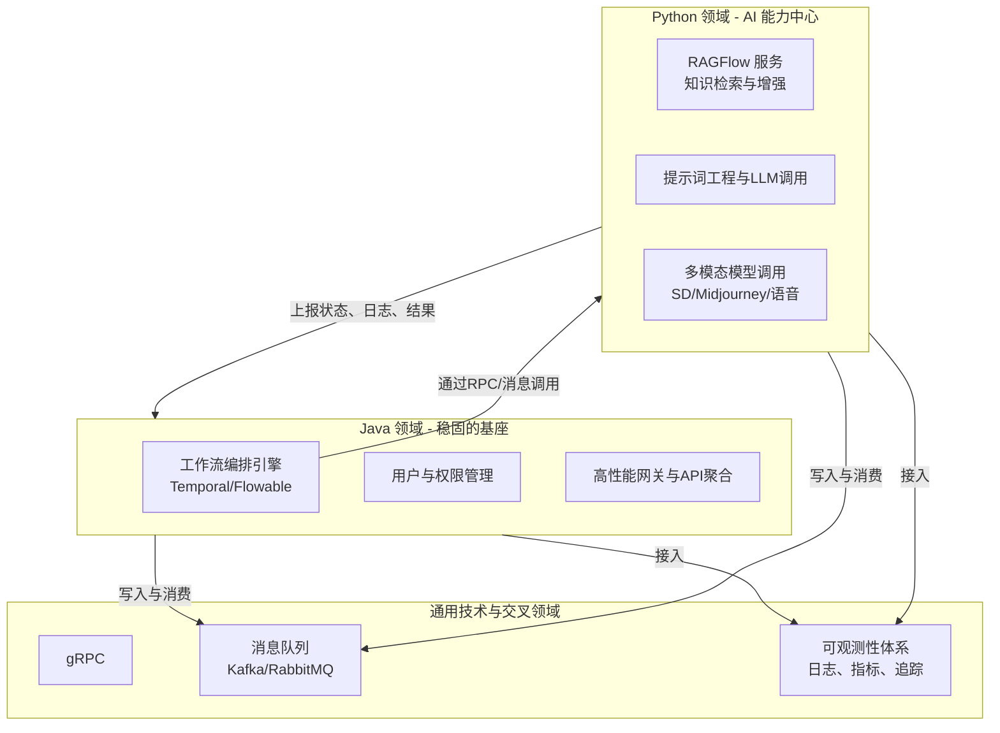

分层架构
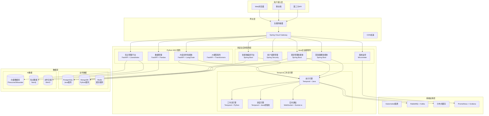

### 2.2 多语言核心架构模式

#### 2.2.1 分层微服务架构
```yaml
Java企业级服务层:
  - 智能体编排平台: Spring Boot + Spring Cloud
  - 用户权限管理: Spring Security + OAuth2
  - 项目管理智能体: Spring Boot + MyBatis
  - 营销策略智能体: Spring Boot + Spring Data
  - 系统监控: Spring Boot + Micrometer

Python AIGC服务层:
  - 内容创作智能体: FastAPI + LangChain
  - 知识管理平台: FastAPI + LlamaIndex
  - 数据管理: FastAPI + Pandas
  - AI模型服务: FastAPI + Transformers

Temporal工作流引擎层:
  - 执行引擎: Temporal + Java
  - 实时通信: WebSocket + Socket.io
  - 任务调度: Temporal + Java线程池
  - 性能监控: Prometheus + Grafana
```

#### 2.2.2 多语言服务通信
```yaml
服务间通信:
  - Java ↔ Java: Feign + Ribbon
  - Java ↔ Python: HTTP + RESTful API
  - Java ↔ Temporal: HTTP + Temporal SDK
  - Python ↔ Temporal: HTTP + Temporal SDK
  - 跨语言: 消息队列 + 事件总线

数据交换:
  - 同步调用: HTTP RESTful API
  - 异步通信: RabbitMQ + Kafka
  - 实时通信: WebSocket + Socket.io
  - 数据同步: 事件驱动 + 最终一致性
```

#### 2.2.3 事件驱动架构
```yaml
事件总线:
  - 消息队列: RabbitMQ (Java服务)
  - 流处理: Kafka (Python服务)
  - 实时事件: WebSocket (Temporal服务)
  - 事件存储: EventStore + 事件溯源

事件处理:
  - Java服务: Spring Cloud Stream
  - Python服务: Celery + Redis
  - Temporal服务: Workflow + Activity
  - 跨语言: 统一事件格式 + 序列化
```

#### 2.2.4 可视化执行引擎架构
```yaml
执行引擎核心(Temporal):
  - 工作流引擎: Temporal高并发任务调度
  - 状态管理: 可中断、可复盘的执行状态
  - 实时通信: WebSocket + Socket.io实时状态同步
  - 检查点机制: Temporal执行状态持久化

编排平台(Java):
  - 流程设计: Spring Boot + 前端集成
  - 模板管理: 企业级模板库
  - 版本控制: Git集成
  - 权限控制: Spring Security

AI服务(Python):
  - 智能体调用: LangChain + 大模型
  - 知识检索: LlamaIndex + 向量数据库
  - 内容生成: 多模态内容生成
  - 质量评估: AI质量评估算法
```

## 3. 核心组件设计

### 3.1 智能体编排平台 (Java企业级服务)

#### 3.1.1 多语言组件架构
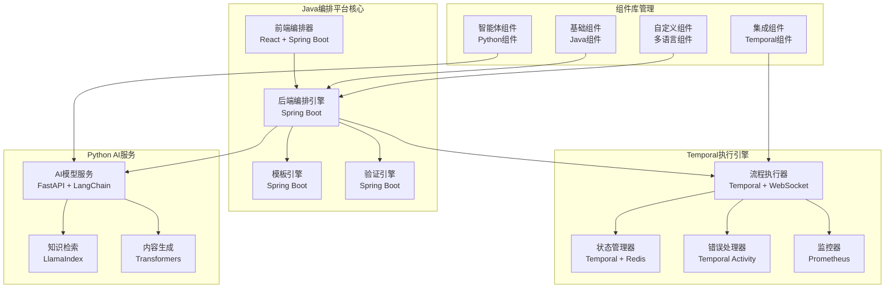

#### 3.1.2 核心功能
- **可视化设计器**：拖拽式流程设计，支持复杂业务逻辑
- **组件库管理**：丰富的组件库，支持自定义组件
- **模板系统**：行业模板库，支持模板分享和交易
- **版本控制**：流程版本管理，支持回滚和对比
- **执行监控**：实时执行监控，支持暂停和恢复

### 3.2 执行引擎 (Temporal工作流引擎)

#### 3.2.1 Temporal工作流引擎架构
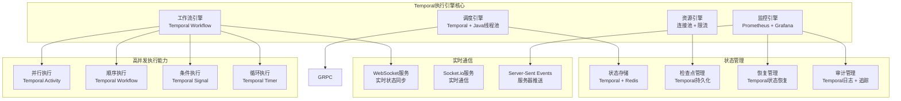

#### 3.2.2 Temporal核心特性
- **高并发执行**：基于Temporal的高并发任务调度，支持数万并发
- **可视化执行**：WebSocket + Socket.io实时状态同步，可视化流程执行监控
- **可中断执行**：支持任务暂停、恢复、回滚，Temporal检查点机制完善
- **可复盘分析**：完整的执行日志和性能分析，支持执行轨迹回放
- **智能调度**：基于资源状态的智能任务调度，支持负载均衡
- **实时通信**：WebSocket + Socket.io双重实时通信保障
- **多语言支持**：支持Java、Python等多种语言，便于团队开发
- **错误处理**：完善的错误处理和恢复机制

### 3.3 知识管理平台 (Python AIGC服务)

#### 3.3.1 Python AIGC平台架构
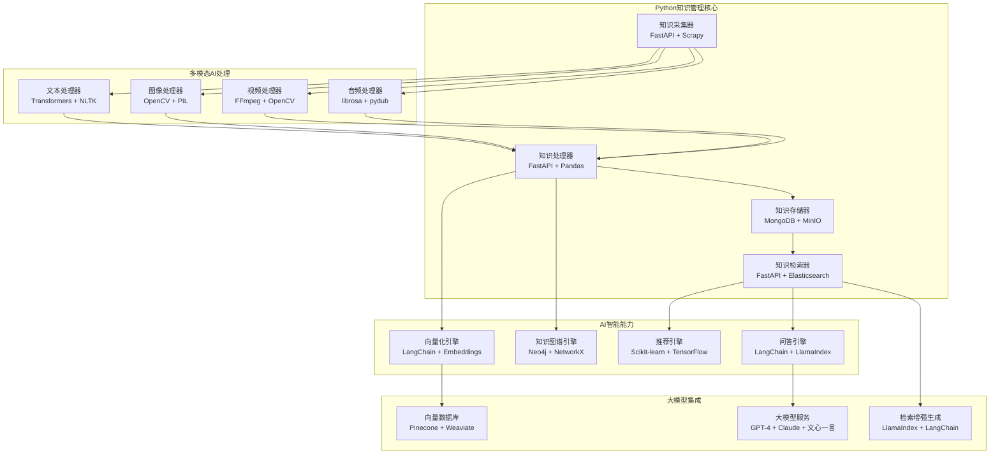

#### 3.3.2 核心能力
- **多源采集**：支持多种数据源的自动采集
- **智能处理**：AI驱动的知识处理和结构化
- **多模态存储**：支持文本、图像、视频等多种知识形式
- **智能检索**：基于语义理解的精准知识检索
- **知识推荐**：主动推送相关知识和最佳实践

## 4. 数据架构设计

### 4.1 数据分层架构

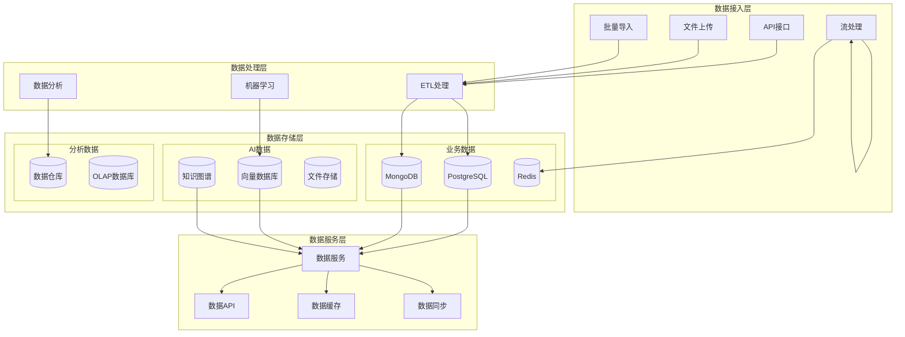

### 4.2 数据模型设计

#### 4.2.1 核心数据实体
```yaml
# 用户相关
User:
  - id: 用户ID
  - username: 用户名
  - email: 邮箱
  - profile: 用户档案
  - permissions: 权限信息

# 项目相关
Project:
  - id: 项目ID
  - name: 项目名称
  - type: 项目类型
  - status: 项目状态
  - timeline: 时间线
  - budget: 预算信息

# 内容相关
Content:
  - id: 内容ID
  - type: 内容类型
  - title: 标题
  - content: 内容
  - metadata: 元数据
  - version: 版本信息

# 知识相关
Knowledge:
  - id: 知识ID
  - title: 标题
  - content: 内容
  - type: 类型
  - tags: 标签
  - vector: 向量表示

# 工作流相关
Workflow:
  - id: 工作流ID
  - name: 名称
  - definition: 定义
  - version: 版本
  - status: 状态
```

#### 4.2.2 数据关系设计
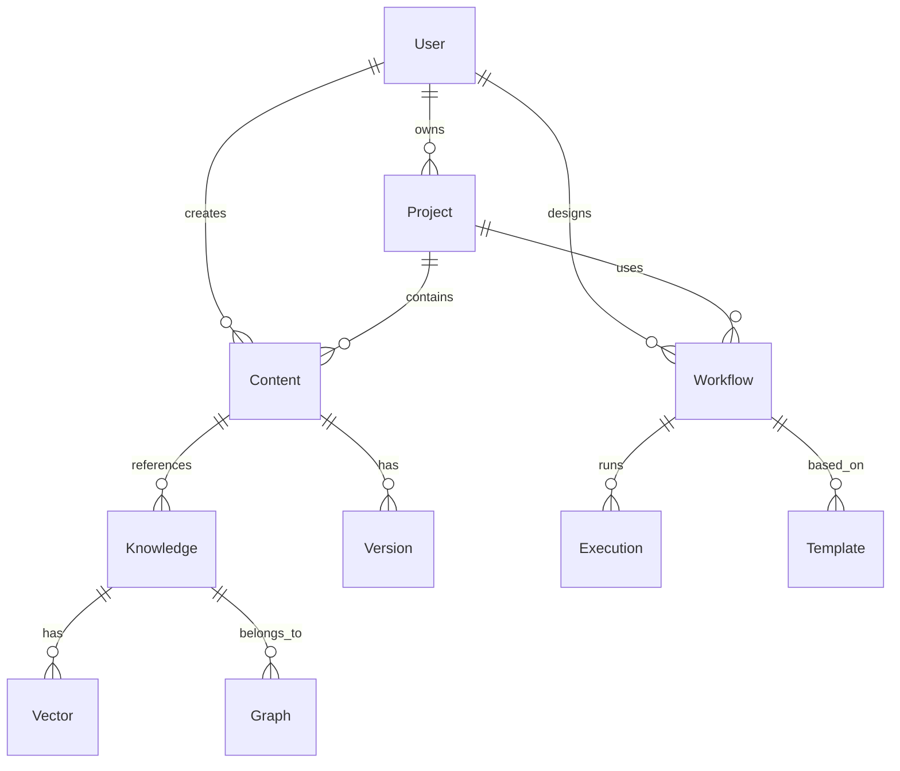

### 4.3 数据安全设计

#### 4.3.1 数据分类
```yaml
公开数据:
  - 公开模板
  - 公开知识
  - 系统配置

内部数据:
  - 用户信息
  - 项目数据
  - 业务数据

机密数据:
  - 财务数据
  - 商业机密
  - 个人隐私

绝密数据:
  - 核心算法
  - 安全密钥
  - 审计日志
```

#### 4.3.2 安全措施
- **数据加密**：敏感数据加密存储和传输
- **访问控制**：基于角色的细粒度访问控制
- **数据脱敏**：非生产环境数据脱敏处理
- **审计日志**：完整的数据访问和操作审计
- **备份恢复**：定期数据备份和灾难恢复

## 5. 安全架构设计

### 5.1 安全分层架构

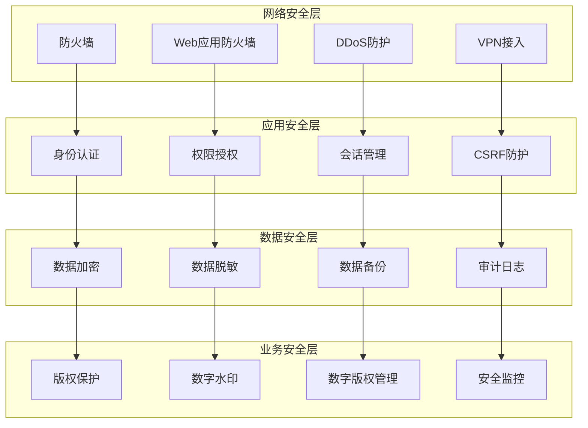

### 5.2 身份认证与授权

#### 5.2.1 认证机制
```yaml
多因子认证:
  - 密码认证
  - 短信验证码
  - 邮箱验证码
  - 双因子认证(2FA)
  - 生物识别认证

单点登录(SSO):
  - SAML 2.0
  - OAuth 2.0
  - OpenID Connect
  - CAS
  - LDAP集成

第三方认证:
  - 微信登录
  - 钉钉登录
  - 企业微信登录
  - 其他OAuth提供商
```

#### 5.2.2 授权模型
```yaml
基于角色的访问控制(RBAC):
  - 角色定义
  - 权限分配
  - 用户角色关联
  - 权限继承

基于属性的访问控制(ABAC):
  - 用户属性
  - 资源属性
  - 环境属性
  - 策略规则

细粒度权限控制:
  - 数据级权限
  - 字段级权限
  - 操作级权限
  - 时间权限
```

### 5.3 数据安全保护

#### 5.3.1 加密策略
```yaml
传输加密:
  - TLS 1.3
  - HTTPS强制
  - API加密
  - 消息加密

存储加密:
  - 数据库加密
  - 文件系统加密
  - 对象存储加密
  - 备份加密

密钥管理:
  - 密钥轮换
  - 密钥分离
  - 硬件安全模块(HSM)
  - 密钥托管服务
```

#### 5.3.2 版权保护
```yaml
数字水印:
  - 不可见水印
  - 可见水印
  - 音频水印
  - 视频水印

内容指纹:
  - 感知哈希
  - 特征提取
  - 相似度检测
  - 盗版追踪

DRM保护:
  - 访问控制
  - 使用限制
  - 时间限制
  - 设备绑定
```

## 6. 部署架构设计

### 6.1 云原生部署架构

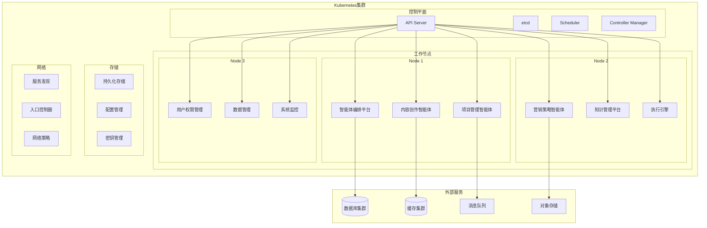

### 6.2 环境规划

#### 6.2.1 环境分层
```yaml
开发环境(Dev):
  - 用途: 日常开发测试
  - 规模: 单节点集群
  - 数据: 测试数据
  - 配置: 开发配置

测试环境(Test):
  - 用途: 功能测试和集成测试
  - 规模: 3节点集群
  - 数据: 脱敏生产数据
  - 配置: 测试配置

预生产环境(Staging):
  - 用途: 生产前验证
  - 规模: 生产环境1/3
  - 数据: 生产数据副本
  - 配置: 生产配置

生产环境(Prod):
  - 用途: 正式业务运行
  - 规模: 高可用集群
  - 数据: 真实业务数据
  - 配置: 生产配置
```

#### 6.2.2 资源规划
```yaml
生产环境资源配置:
  Kubernetes集群:
    - 控制节点: 3个 (4C8G)
    - 工作节点: 6个 (8C16G)
    - 存储节点: 3个 (4C8G + 1TB SSD)
  
  数据库集群:
    - PostgreSQL主从: 2个 (8C16G + 500GB SSD)
    - MongoDB副本集: 3个 (4C8G + 200GB SSD)
    - Redis集群: 6个 (2C4G + 50GB SSD)
  
  消息队列:
    - RabbitMQ集群: 3个 (4C8G + 100GB SSD)
  
  存储服务:
    - MinIO集群: 4个 (4C8G + 1TB HDD)
```

### 6.3 CI/CD流水线

#### 6.3.1 流水线设计
```mermaid
graph LR
    subgraph "代码管理"
        Git[Git仓库]
        MR[合并请求]
        Review[代码审查]
    end
    
    subgraph "构建阶段"
        Build[代码构建]
        Test[单元测试]
        Lint[代码检查]
        Security[安全扫描]
    end
    
    subgraph "测试阶段"
        Deploy[部署到测试环境]
        Integration[集成测试]
        Performance[性能测试]
        E2E[端到端测试]
    end
    
    subgraph "发布阶段"
        Staging[部署到预生产]
        UAT[用户验收测试]
        Production[部署到生产]
        Monitor[生产监控]
    end
    
    Git --> MR
    MR --> Review
    Review --> Build
    Build --> Test
    Test --> Lint
    Lint --> Security
    Security --> Deploy
    Deploy --> Integration
    Integration --> Performance
    Performance --> E2E
    E2E --> Staging
    Staging --> UAT
    UAT --> Production
    Production --> Monitor
```

#### 6.3.2 自动化策略
```yaml
构建自动化:
  - 代码提交触发构建
  - 自动运行单元测试
  - 自动代码质量检查
  - 自动安全漏洞扫描

测试自动化:
  - 自动部署到测试环境
  - 自动运行集成测试
  - 自动性能测试
  - 自动端到端测试

部署自动化:
  - 蓝绿部署
  - 金丝雀发布
  - 滚动更新
  - 自动回滚

监控自动化:
  - 自动健康检查
  - 自动性能监控
  - 自动告警通知
  - 自动故障恢复
```

## 7. 监控架构设计

### 7.1 监控体系架构

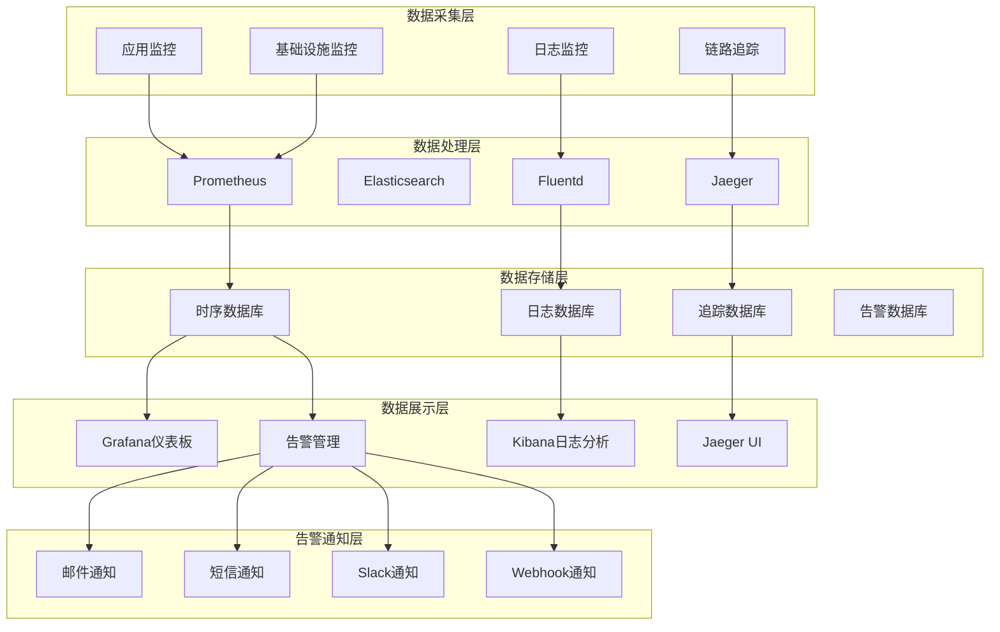

### 7.2 监控指标体系

#### 7.2.1 业务监控指标
```yaml
用户指标:
  - 活跃用户数(DAU/MAU)
  - 新用户注册数
  - 用户留存率
  - 用户满意度

业务指标:
  - 项目完成率
  - 内容创作量
  - 营销转化率
  - 收入指标

智能体指标:
  - 任务执行成功率
  - 智能体响应时间
  - 知识检索准确率
  - 推荐点击率
```

#### 7.2.2 技术监控指标
```yaml
系统指标:
  - CPU使用率
  - 内存使用率
  - 磁盘I/O
  - 网络流量

应用指标:
  - API响应时间
  - 请求成功率
  - 错误率
  - 吞吐量

数据库指标:
  - 连接数
  - 查询性能
  - 锁等待
  - 缓存命中率

中间件指标:
  - 消息队列长度
  - 消息处理延迟
  - 缓存命中率
  - 服务发现延迟
```

### 7.3 告警策略

#### 7.3.1 告警分级
```yaml
紧急告警(Critical):
  - 系统不可用
  - 数据丢失
  - 安全事件
  - 响应时间: 立即

重要告警(Major):
  - 性能严重下降
  - 服务异常
  - 资源不足
  - 响应时间: 5分钟内

一般告警(Minor):
  - 性能轻微下降
  - 配置变更
  - 维护提醒
  - 响应时间: 30分钟内

信息告警(Info):
  - 状态变更
  - 统计信息
  - 日志记录
  - 响应时间: 1小时内
```

#### 7.3.2 告警规则
```yaml
系统告警规则:
  - CPU使用率 > 80% 持续5分钟
  - 内存使用率 > 85% 持续5分钟
  - 磁盘使用率 > 90%
  - 网络延迟 > 100ms

应用告警规则:
  - API响应时间 > 1秒
  - 错误率 > 5%
  - 请求成功率 < 95%
  - 并发连接数 > 1000

数据库告警规则:
  - 连接数 > 80% 最大连接数
  - 慢查询 > 10个/分钟
  - 锁等待时间 > 5秒
  - 缓存命中率 < 80%

业务告警规则:
  - 用户登录失败率 > 10%
  - 任务执行失败率 > 5%
  - 内容生成质量评分 < 7分
  - 营销转化率下降 > 20%
```

## 8. 容灾架构设计

### 8.1 容灾策略

#### 8.1.1 多活架构
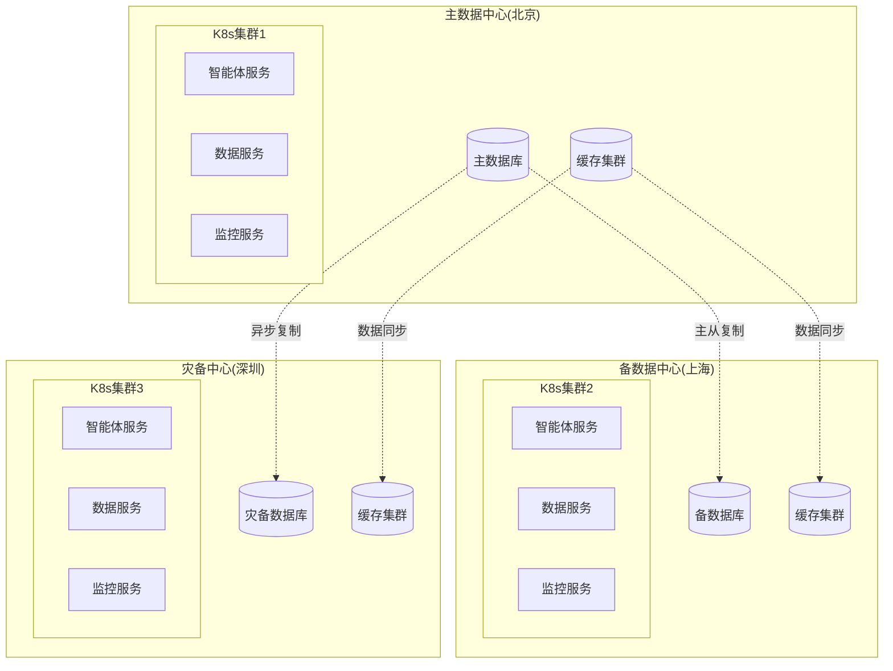

#### 8.1.2 数据备份策略
```yaml
备份类型:
  全量备份:
    - 频率: 每周一次
    - 保留: 4周
    - 存储: 异地存储
  
  增量备份:
    - 频率: 每日一次
    - 保留: 30天
    - 存储: 本地+异地
  
  实时备份:
    - 方式: 主从复制
    - 延迟: < 1秒
    - 存储: 同城异地

备份验证:
  - 定期恢复测试
  - 数据完整性检查
  - 恢复时间测试
  - 备份可用性验证
```

### 8.2 故障恢复

#### 8.2.1 故障检测
```yaml
自动检测:
  - 健康检查
  - 心跳检测
  - 性能监控
  - 业务监控

故障分类:
  服务故障:
    - 服务不可用
    - 服务响应慢
    - 服务错误率高
  
  基础设施故障:
    - 服务器故障
    - 网络故障
    - 存储故障
    - 数据库故障
  
  业务故障:
    - 数据异常
    - 业务逻辑错误
    - 用户操作异常
```

#### 8.2.2 恢复策略
```yaml
自动恢复:
  - 服务重启
  - 负载转移
  - 流量切换
  - 资源扩容

手动恢复:
  - 故障诊断
  - 数据修复
  - 配置调整
  - 系统重建

恢复时间目标:
  - RTO: 30分钟
  - RPO: 5分钟
  - 可用性: 99.9%
  - 数据完整性: 100%
```

## 9. 性能优化设计

### 9.1 性能优化策略

#### 9.1.1 应用层优化
```yaml
代码优化:
  - 算法优化
  - 数据结构优化
  - 内存使用优化
  - 并发处理优化

缓存策略:
  - 应用缓存
  - 数据库缓存
  - CDN缓存
  - 浏览器缓存

异步处理:
  - 消息队列
  - 异步任务
  - 事件驱动
  - 流式处理
```

#### 9.1.2 数据层优化
```yaml
数据库优化:
  - 索引优化
  - 查询优化
  - 分区策略
  - 读写分离

存储优化:
  - 数据压缩
  - 数据归档
  - 冷热分离
  - 存储分层

网络优化:
  - 连接池
  - 批量操作
  - 数据压缩
  - 协议优化
```

### 9.2 扩展性设计

#### 9.2.1 水平扩展
```yaml
服务扩展:
  - 无状态服务
  - 负载均衡
  - 自动扩缩容
  - 服务发现

数据扩展:
  - 分库分表
  - 读写分离
  - 数据分片
  - 分布式存储

计算扩展:
  - 分布式计算
  - 任务调度
  - 资源池化
  - 弹性伸缩
```

#### 9.2.2 垂直扩展
```yaml
硬件升级:
  - CPU升级
  - 内存升级
  - 存储升级
  - 网络升级

软件优化:
  - 算法优化
  - 架构优化
  - 配置优化
  - 参数调优
```

## 10. 实施计划

### 10.1 架构实施阶段

#### 10.1.1 第一阶段：基础架构(1-2个月)
```yaml
基础设施搭建:
  - Kubernetes集群部署
  - 数据库集群搭建
  - 监控系统部署
  - CI/CD流水线搭建

核心服务开发:
  - 用户权限管理
  - 数据管理平台
  - 系统监控服务
  - API网关服务

技术验证:
  - 微服务架构验证
  - 数据库性能测试
  - 监控系统验证
  - 安全机制验证
```

#### 10.1.2 第二阶段：智能体平台(2-3个月)
```yaml
智能体编排平台:
  - 可视化设计器
  - 组件库管理
  - 模板系统
  - 版本控制

执行引擎:
  - 工作流引擎
  - 调度引擎
  - 状态管理
  - 监控告警

知识管理平台:
  - 知识采集
  - 知识处理
  - 知识存储
  - 知识检索
```

#### 10.1.3 第三阶段：业务智能体(2-3个月)
```yaml
内容创作智能体:
  - 剧本创作
  - 分镜设计
  - 角色设计
  - 质量评估

项目管理智能体:
  - 项目规划
  - 进度监控
  - 资源调度
  - 成本控制

营销策略智能体:
  - 市场分析
  - 策略制定
  - 效果评估
  - 优化建议
```

#### 10.1.4 第四阶段：系统优化(1-2个月)
```yaml
性能优化:
  - 系统性能调优
  - 数据库优化
  - 缓存优化
  - 网络优化

安全加固:
  - 安全漏洞修复
  - 权限控制优化
  - 数据加密加强
  - 审计日志完善

用户体验优化:
  - 界面优化
  - 交互优化
  - 响应速度优化
  - 错误处理优化
```

### 10.2 团队配置

#### 10.2.1 核心团队
```yaml
技术架构师: 1人
  - 负责整体架构设计
  - 技术选型和决策
  - 技术难点攻关

后端开发团队: 10人
  - Java微服务开发: 4人
  - Python AI/ML开发: 3人
  - Temporal工作流开发: 2人
  - 数据开发: 1人

前端开发团队: 4人
  - React开发: 3人
  - 可视化开发: 1人

DevOps团队: 3人
  - 基础设施: 1人
  - 监控运维: 1人
  - CI/CD: 1人

测试团队: 4人
  - 功能测试: 2人
  - 性能测试: 1人
  - 安全测试: 1人
```

#### 10.2.2 技能要求
```yaml
Java后端开发:
  - Java 17+
  - Spring Boot 3.x + Spring Cloud
  - Nacos + Sentinel + Seata
  - PostgreSQL
  - Docker/Kubernetes

Python后端开发:
  - Python 3.11
  - FastAPI + LangChain
  - MongoDB/Redis
  - Temporal SDK
  - Docker/Kubernetes

AI/ML开发:
  - LangChain + FastAPI
  - 多模态大模型集成
  - 多模态数据处理
  - Pinecone向量数据库
  - Neo4j知识图谱

Temporal工作流开发:
  - Temporal SDK (Java/Python)
  - 工作流设计
  - 分布式任务调度
  - WebSocket + Socket.io
  - 状态管理和恢复

前端开发:
  - React 18 + TypeScript
  - Redux Toolkit
  - Ant Design
  - React Flow
  - Socket.io

DevOps:
  - Kubernetes
  - Docker
  - Prometheus/Grafana
  - GitLab CI
  - 云平台管理
```

## 11. 总结

### 11.1 架构特点
1. **多语言架构**：Java企业级微服务 + Python AIGC + Temporal工作流引擎
2. **技术先进**：采用最新的微服务架构和云原生技术
3. **高可用性**：多活架构和容灾设计，确保系统稳定运行
4. **可扩展性**：支持水平扩展和垂直扩展，满足业务增长需求
5. **安全性**：多层次安全防护，保护数据和知识产权
6. **可维护性**：模块化设计，便于维护和升级

### 11.2 技术优势
1. **Temporal执行引擎**：完美支持可视化、可中断、可复盘功能
2. **AI驱动**：深度集成AI技术，提供智能化服务
3. **多语言优势**：发挥Java、Python各自技术优势
4. **可视化**：直观的可视化界面，降低使用门槛
5. **实时性**：支持实时协作和实时监控
6. **集成性**：与现有系统无缝集成
7. **标准化**：遵循行业标准，确保兼容性

### 11.3 实施保障
1. **技术预研**：充分的技术预研和验证
2. **团队建设**：专业的开发团队和技能培训
3. **项目管理**：科学的项目管理和风险控制
4. **质量保证**：完善的测试体系和质量管理
5. **运维支持**：专业的运维团队和监控体系

---

**文档版本**：v1.0  
**创建日期**：2024年12月  
**最后更新**：2024年12月  
**文档状态**：已完成  
**下一步**：各模块架构设计
