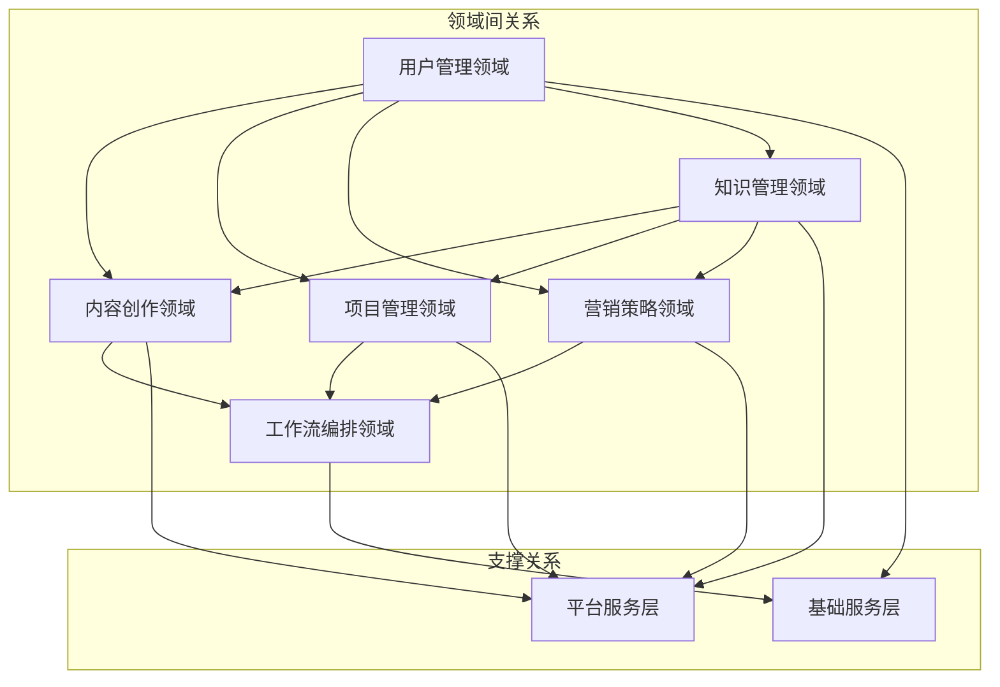
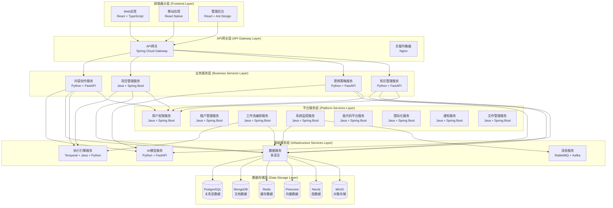
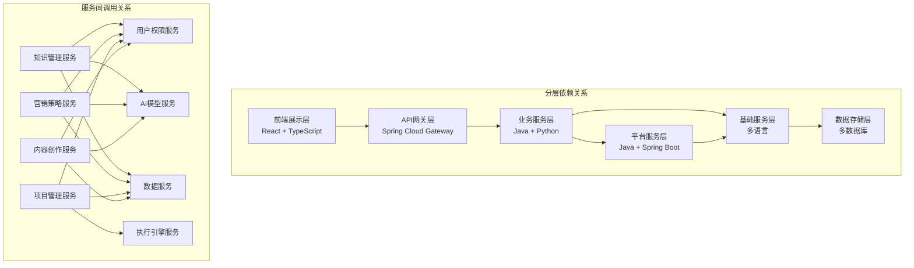
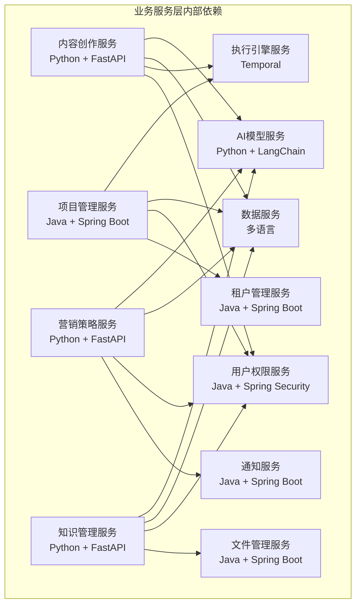
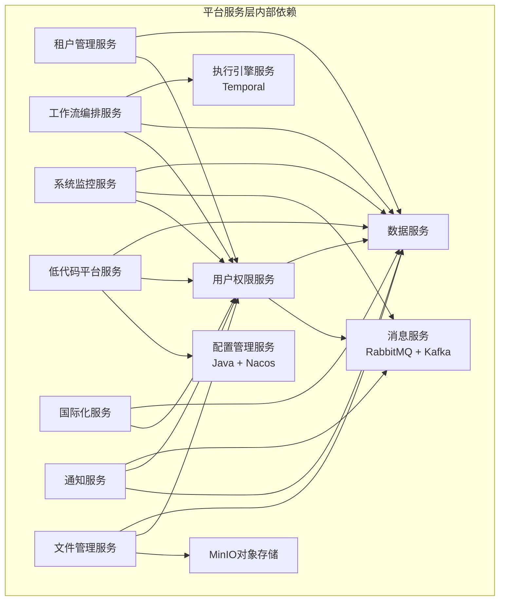
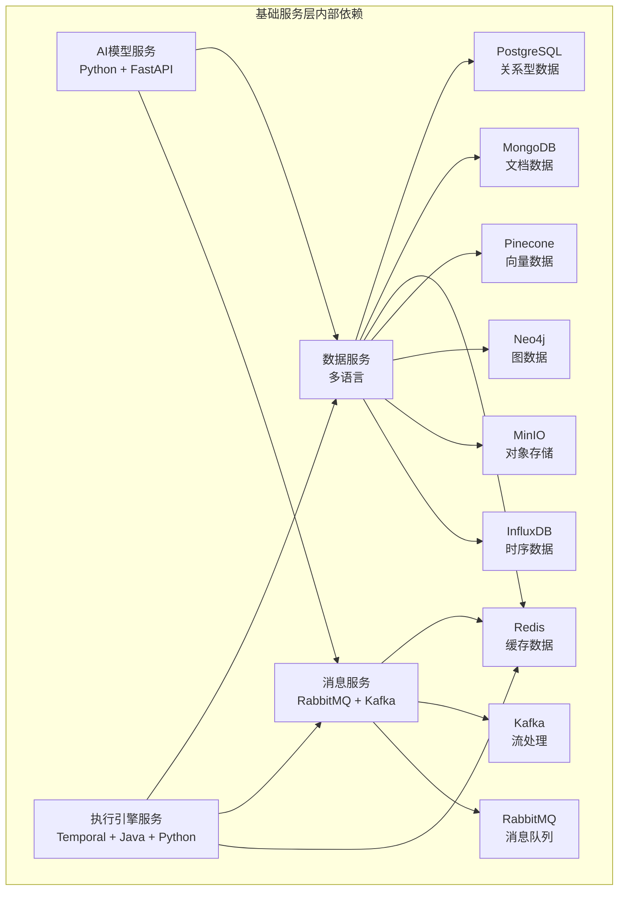
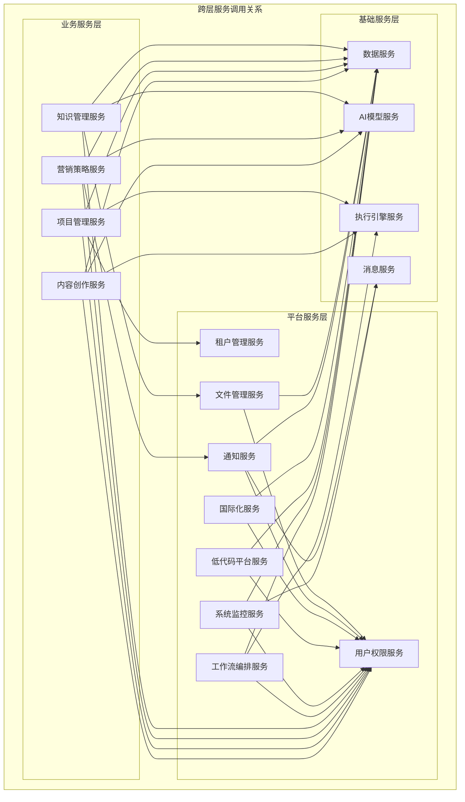
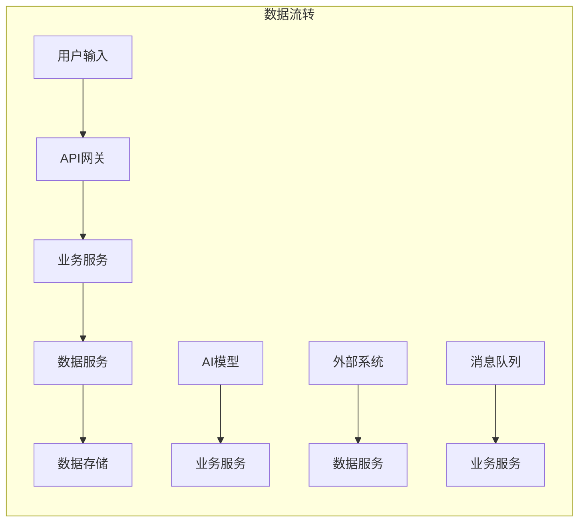
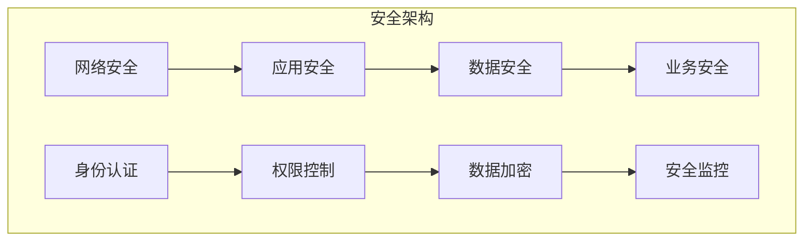
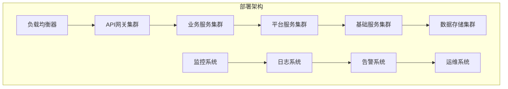

# 剧工厂企业级智能体平台 - 分层架构设计

## 1. 分层架构概述

### 1.1 设计理念
基于DDD（领域驱动设计）理论和分层架构最佳实践，采用"基础服务-平台服务-业务服务"的三层架构模式，确保系统的可扩展性、可维护性和高内聚低耦合。

### 1.2 架构原则
- **分层解耦**：各层职责清晰，依赖关系单向
- **技术适配**：每层选择最适合的技术栈
- **业务导向**：按DDD限界上下文划分业务领域
- **可扩展性**：支持水平扩展和功能扩展
- **高可用性**：确保系统稳定运行

### 1.3 DDD领域分析过程

#### 1.3.1 业务领域识别
基于产品需求文档，识别以下核心业务领域：

```yaml
核心业务领域:
  1. 内容创作领域 (Content Creation Domain)
     - 限界上下文: 剧本创作、分镜设计、角色设计
     - 核心价值: 创意生成和内容生产
     - 业务规则: 创作流程、质量标准、版权保护
  
  2. 项目管理领域 (Project Management Domain)
     - 限界上下文: 项目规划、进度监控、资源调度
     - 核心价值: 项目全生命周期管理
     - 业务规则: 项目分解、时间管理、资源分配
  
  3. 营销策略领域 (Marketing Strategy Domain)
     - 限界上下文: 市场分析、营销策略、发行策略
     - 核心价值: 数据驱动的营销决策
     - 业务规则: 市场预测、策略制定、效果评估
  
  4. 知识管理领域 (Knowledge Management Domain)
     - 限界上下文: 知识库构建、智能检索、知识应用
     - 核心价值: 企业知识资产化
     - 业务规则: 知识分类、检索算法、应用场景

支撑领域:
  5. 工作流编排领域 (Workflow Orchestration Domain)
     - 限界上下文: 流程设计、执行管理、状态控制
     - 核心价值: 业务流程自动化
     - 业务规则: 流程定义、执行控制、异常处理
  
  6. 用户管理领域 (User Management Domain)
     - 限界上下文: 用户认证、权限控制、租户管理
     - 核心价值: 多租户安全访问
     - 业务规则: 身份验证、权限分配、租户隔离
```

#### 1.3.2 横向分层分析（按技术职责）

```yaml
# 第一层：基础服务层 (Infrastructure Services)
职责: 提供底层技术能力封装
设计原则: 技术能力抽象，多语言支持
模块划分:
  - 数据服务模块: 统一数据访问接口
  - AI模型服务模块: AI能力封装
  - 执行引擎服务模块: 工作流执行能力
  - 消息服务模块: 异步通信能力

# 第二层：平台服务层 (Platform Services)
职责: 提供企业级平台能力
设计原则: 通用平台能力，多租户支持
模块划分:
  - 用户权限服务模块: 身份认证和授权
  - 租户管理服务模块: 多租户隔离
  - 工作流编排服务模块: 流程设计和管理
  - 系统监控服务模块: 监控和告警
  - 低代码平台服务模块: 元数据驱动开发
  - 国际化服务模块: 多语言支持
  - 通知服务模块: 多渠道通知
  - 文件管理服务模块: 文件存储管理

# 第三层：业务服务层 (Business Services)
职责: 实现具体业务逻辑
设计原则: 业务领域驱动，高内聚低耦合
模块划分:
  - 内容创作服务模块: 内容创作业务逻辑
  - 项目管理服务模块: 项目管理业务逻辑
  - 营销策略服务模块: 营销策略业务逻辑
  - 知识管理服务模块: 知识管理业务逻辑
```

#### 1.3.3 纵向分域分析（按DDD限界上下文）

```yaml
每个限界上下文的内部架构:
  应用层 (Application Layer):
    - 应用服务: 协调领域对象完成业务用例
    - 命令处理器: 处理业务命令
    - 查询处理器: 处理业务查询
    - DTO转换器: 数据传输对象转换
  
  领域层 (Domain Layer):
    - 聚合根: 业务一致性边界
    - 实体: 具有唯一标识的业务对象
    - 值对象: 无标识的业务概念
    - 领域服务: 跨聚合的业务逻辑
    - 仓储接口: 数据访问抽象
  
  基础设施层 (Infrastructure Layer):
    - 仓储实现: 数据访问具体实现
    - 外部服务适配器: 第三方服务集成
    - 消息发布器: 领域事件发布
    - 数据持久化: 数据存储实现
```

#### 1.3.4 领域间关系分析



### 1.3 整体架构图



## 2. 各层职责和边界

### 2.1 前端展示层 (Frontend Layer)

#### 2.1.1 职责定义
- **用户界面展示**：提供直观的用户交互界面
- **数据可视化**：展示业务数据和执行状态
- **用户交互处理**：处理用户输入和操作反馈
- **响应式设计**：支持多端适配

#### 2.1.2 技术栈
```yaml
核心框架: React 18 + TypeScript
状态管理: Redux Toolkit
UI组件: Ant Design + 自定义组件
可视化: React Flow + ECharts + Konva.js + D3.js
实时通信: Socket.io + WebSocket
构建工具: Vite + Webpack
```

#### 2.1.3 边界约束
- **不直接访问数据库**：所有数据通过API获取
- **不包含业务逻辑**：业务逻辑在服务层处理
- **不处理数据持久化**：数据持久化由后端服务负责

### 2.2 API网关层 (API Gateway Layer)

#### 2.2.1 职责定义
- **请求路由**：将请求路由到相应的后端服务
- **负载均衡**：分发请求到多个服务实例
- **安全控制**：API认证、授权、限流
- **协议转换**：HTTP/HTTPS协议处理

#### 2.2.2 技术栈
```yaml
网关框架: Spring Cloud Gateway
负载均衡: Nginx + Ribbon
安全框架: Spring Security + OAuth2
监控: Micrometer + Prometheus
```

#### 2.2.3 边界约束
- **不处理业务逻辑**：只负责请求转发
- **不存储业务数据**：只处理请求响应
- **不直接访问数据库**：通过服务调用获取数据

### 2.3 业务服务层 (Business Services Layer)

#### 2.3.1 职责定义
- **业务逻辑实现**：实现具体的业务功能
- **领域模型管理**：管理业务领域对象
- **业务流程控制**：控制业务执行流程
- **业务规则验证**：验证业务规则和约束

#### 2.3.2 技术栈
```yaml
内容创作服务: Python + FastAPI + LangChain
项目管理服务: Java + Spring Boot + Temporal
营销策略服务: Python + FastAPI + 数据分析
知识管理服务: Python + FastAPI + Neo4j + Pinecone
```

#### 2.3.3 边界约束
- **不直接访问数据存储**：通过数据服务层访问
- **不处理基础设施逻辑**：基础设施逻辑在基础服务层
- **不处理平台通用功能**：平台功能在平台服务层

### 2.4 平台服务层 (Platform Services Layer)

#### 2.4.1 职责定义
- **企业级平台能力**：提供通用的平台服务
- **多租户支持**：支持多租户隔离和管理
- **用户权限管理**：提供统一的用户认证授权
- **系统监控管理**：提供系统监控和告警

#### 2.4.2 技术栈
```yaml
核心框架: Java + Spring Boot + Spring Cloud
安全框架: Spring Security + OAuth2 + JWT
监控框架: Micrometer + Prometheus + Grafana
配置管理: Nacos + Spring Cloud Config
```

#### 2.4.3 边界约束
- **不包含具体业务逻辑**：业务逻辑在业务服务层
- **不直接访问AI模型**：通过AI模型服务访问
- **不处理数据存储细节**：通过数据服务层处理

### 2.5 基础服务层 (Infrastructure Services Layer)

#### 2.5.1 职责定义
- **技术能力封装**：封装底层技术能力
- **数据访问管理**：提供统一的数据访问接口
- **AI模型管理**：管理AI模型的调用和集成
- **消息通信管理**：提供异步消息通信能力

#### 2.5.2 技术栈
```yaml
数据服务: 多语言 + 数据访问层
AI模型服务: Python + FastAPI + LangChain
执行引擎服务: Temporal + Java + Python
消息服务: RabbitMQ + Kafka + Redis
```

#### 2.5.3 边界约束
- **不包含业务逻辑**：只提供技术能力
- **不处理用户界面**：用户界面在前端层
- **不处理业务流程**：业务流程在业务服务层

### 2.6 数据存储层 (Data Storage Layer)

#### 2.6.1 职责定义
- **数据持久化**：提供数据存储和检索
- **数据一致性**：保证数据的一致性和完整性
- **数据备份恢复**：提供数据备份和恢复能力
- **数据安全**：保证数据的安全性和隐私性

#### 2.6.2 技术栈
```yaml
关系型数据库: PostgreSQL 15
文档数据库: MongoDB 6
缓存数据库: Redis 7
向量数据库: Pinecone
图数据库: Neo4j
对象存储: MinIO
时序数据库: InfluxDB
```

#### 2.6.3 边界约束
- **不处理业务逻辑**：只负责数据存储
- **不直接对外服务**：通过数据服务层访问
- **不处理用户交互**：用户交互在前端层

## 3. 层间依赖关系

### 3.1 依赖原则
- **单向依赖**：上层依赖下层，下层不依赖上层
- **接口隔离**：通过接口进行层间通信
- **依赖倒置**：依赖抽象而不是具体实现

### 3.2 详细依赖关系图

#### 3.2.1 分层依赖关系图



#### 3.2.2 业务服务层内部依赖关系



#### 3.2.3 平台服务层内部依赖关系



#### 3.2.4 基础服务层内部依赖关系



#### 3.2.5 跨层服务调用关系



### 3.3 服务间交互模式

#### 3.3.1 同步调用模式

```yaml
场景: 实时业务处理
特点: 请求-响应模式，实时返回结果
实现: HTTP RESTful API + gRPC

典型调用链:
  1. 用户请求 → API网关 → 业务服务 → 平台服务 → 基础服务 → 数据存储
  2. 响应数据 ← API网关 ← 业务服务 ← 平台服务 ← 基础服务 ← 数据存储

示例:
  - 用户登录: 前端 → 网关 → 用户权限服务 → 数据服务 → PostgreSQL
  - 内容创作: 前端 → 网关 → 内容创作服务 → AI模型服务 → 大模型API
  - 项目管理: 前端 → 网关 → 项目管理服务 → 执行引擎服务 → Temporal
```

#### 3.3.2 异步消息模式

```yaml
场景: 非实时业务处理，解耦服务
特点: 发布-订阅模式，最终一致性
实现: RabbitMQ + Kafka + Redis

典型调用链:
  1. 业务事件发生 → 发布领域事件 → 消息队列 → 订阅服务处理
  2. 订阅服务 → 基础服务 → 数据存储

示例:
  - 用户注册: 用户权限服务 → 发布用户创建事件 → 通知服务 → 发送欢迎邮件
  - 项目完成: 项目管理服务 → 发布项目完成事件 → 营销策略服务 → 生成营销报告
  - 内容审核: 内容创作服务 → 发布内容审核事件 → 知识管理服务 → 更新知识库
```

#### 3.3.3 事件驱动模式

```yaml
场景: 复杂业务流程，状态变更通知
特点: 事件驱动，状态机管理
实现: Temporal + 领域事件

典型调用链:
  1. 业务操作 → 触发领域事件 → 工作流引擎 → 执行相关活动
  2. 活动执行 → 更新状态 → 触发新事件 → 继续工作流

示例:
  - 剧本创作流程: 需求分析 → 大纲生成 → 角色设计 → 场景创作 → 剧本完成
  - 项目审批流程: 项目申请 → 部门审批 → 财务审批 → 领导审批 → 项目启动
  - 营销策略流程: 市场分析 → 策略制定 → 预算分配 → 执行监控 → 效果评估
```

#### 3.3.4 数据同步模式

```yaml
场景: 数据一致性保证，跨服务数据同步
特点: 数据同步，一致性保证
实现: 数据服务 + 消息队列

典型调用链:
  1. 主数据变更 → 数据服务 → 发布数据变更事件 → 相关服务同步
  2. 相关服务 → 数据服务 → 更新本地数据 → 确认同步完成

示例:
  - 用户信息同步: 用户权限服务 → 用户信息变更 → 各业务服务同步用户信息
  - 项目状态同步: 项目管理服务 → 项目状态变更 → 相关服务同步项目状态
  - 知识库同步: 知识管理服务 → 知识更新 → 内容创作服务同步知识库
```

### 3.4 具体依赖关系

#### 3.4.1 前端展示层依赖
```yaml
直接依赖:
  - API网关层: 通过HTTP/WebSocket调用后端API

间接依赖:
  - 业务服务层: 通过API网关调用业务功能
  - 平台服务层: 通过API网关调用平台功能
  - 基础服务层: 通过API网关调用基础功能
```

#### 3.4.2 API网关层依赖
```yaml
直接依赖:
  - 业务服务层: 路由请求到业务服务
  - 平台服务层: 路由请求到平台服务

间接依赖:
  - 基础服务层: 通过业务服务调用基础功能
  - 数据存储层: 通过服务层访问数据
```

#### 3.4.3 业务服务层依赖
```yaml
直接依赖:
  - 平台服务层: 调用用户权限、租户管理等服务
  - 基础服务层: 调用数据服务、AI模型服务等

间接依赖:
  - 数据存储层: 通过基础服务层访问数据
```

#### 3.4.4 平台服务层依赖
```yaml
直接依赖:
  - 基础服务层: 调用数据服务、消息服务等

间接依赖:
  - 数据存储层: 通过基础服务层访问数据
```

#### 3.4.5 基础服务层依赖
```yaml
直接依赖:
  - 数据存储层: 直接访问各种数据库

无间接依赖:
  - 作为最底层，不依赖其他服务层
```

### 3.5 服务间通信协议

#### 3.5.1 同步通信协议
```yaml
HTTP RESTful API:
  - 协议: HTTP/HTTPS
  - 数据格式: JSON
  - 认证: OAuth2 + JWT
  - 适用场景: 业务服务间调用、前后端通信

gRPC:
  - 协议: HTTP/2
  - 数据格式: Protocol Buffers
  - 认证: TLS + Token
  - 适用场景: 高性能服务间调用、跨语言通信

WebSocket:
  - 协议: WebSocket
  - 数据格式: JSON/二进制
  - 认证: JWT Token
  - 适用场景: 实时通信、状态推送
```

#### 3.5.2 异步通信协议
```yaml
RabbitMQ:
  - 协议: AMQP
  - 数据格式: JSON/二进制
  - 认证: 用户名密码
  - 适用场景: 可靠消息传递、任务队列

Kafka:
  - 协议: TCP
  - 数据格式: 二进制
  - 认证: SASL/SSL
  - 适用场景: 高吞吐量流处理、事件溯源

Redis:
  - 协议: RESP
  - 数据格式: 字符串/二进制
  - 认证: 密码
  - 适用场景: 轻量级消息传递、缓存
```

## 4. 技术选型原则

### 4.1 选型原则
- **业务适配性**：技术栈与业务需求匹配
- **团队技能匹配**：考虑团队现有技能
- **技术成熟度**：选择成熟稳定的技术
- **社区活跃度**：选择社区活跃的技术
- **性能要求**：满足性能要求
- **成本控制**：控制开发和运维成本

### 4.2 各层技术选型

#### 4.2.1 前端展示层
```yaml
选型原则:
  - 用户体验优先
  - 开发效率高
  - 社区生态丰富
  - 性能表现优秀

技术栈:
  - React 18: 成熟的前端框架，生态丰富
  - TypeScript: 类型安全，提高代码质量
  - Ant Design: 企业级UI组件库
  - Redux Toolkit: 状态管理，支持时间旅行调试
```

#### 4.2.2 API网关层
```yaml
选型原则:
  - 高性能路由
  - 安全控制能力强
  - 监控和可观测性
  - 与Spring Cloud生态集成

技术栈:
  - Spring Cloud Gateway: 高性能API网关
  - Nginx: 负载均衡和反向代理
  - Spring Security: 安全框架
  - Micrometer: 监控指标收集
```

#### 4.2.3 业务服务层
```yaml
选型原则:
  - 按业务特点选择最适合的技术
  - AI相关业务使用Python
  - 企业级业务使用Java
  - 支持微服务架构

技术栈:
  - Java + Spring Boot: 企业级微服务
  - Python + FastAPI: AI和数据分析
  - Temporal: 工作流执行引擎
  - LangChain: AI应用开发框架
```

#### 4.2.4 平台服务层
```yaml
选型原则:
  - 企业级特性丰富
  - 安全控制能力强
  - 多租户支持
  - 监控和运维友好

技术栈:
  - Java + Spring Boot: 企业级应用框架
  - Spring Cloud: 微服务治理
  - Spring Security: 安全框架
  - Nacos: 服务注册发现和配置管理
```

#### 4.2.5 基础服务层
```yaml
选型原则:
  - 技术能力封装
  - 高性能和可扩展
  - 多语言支持
  - 云原生架构

技术栈:
  - Temporal: 分布式工作流引擎
  - Python + FastAPI: AI模型服务
  - RabbitMQ + Kafka: 消息队列
  - Redis: 缓存和会话存储
```

#### 4.2.6 数据存储层
```yaml
选型原则:
  - 数据模型匹配
  - 性能要求满足
  - 可扩展性强
  - 运维成本可控

技术栈:
  - PostgreSQL: 关系型数据，ACID特性
  - MongoDB: 文档数据，灵活schema
  - Redis: 缓存数据，高性能
  - Pinecone: 向量数据，AI应用
  - Neo4j: 图数据，关系分析
  - MinIO: 对象存储，文件管理
```

## 5. 接口设计规范

### 5.1 接口设计原则
- **RESTful设计**：遵循REST架构风格
- **版本管理**：支持API版本控制
- **文档化**：提供完整的API文档
- **标准化**：统一的请求响应格式
- **安全性**：支持认证和授权

### 5.2 接口规范

#### 5.2.1 RESTful API规范
```yaml
URL设计:
  - 使用名词而非动词
  - 使用复数形式
  - 使用层级结构
  - 使用查询参数过滤

HTTP方法:
  - GET: 查询资源
  - POST: 创建资源
  - PUT: 更新资源
  - DELETE: 删除资源
  - PATCH: 部分更新资源

状态码:
  - 200: 成功
  - 201: 创建成功
  - 400: 请求错误
  - 401: 未授权
  - 403: 禁止访问
  - 404: 资源不存在
  - 500: 服务器错误
```

#### 5.2.2 请求响应格式
```yaml
统一响应格式:
  {
    "code": 200,
    "message": "success",
    "data": {},
    "timestamp": "2024-12-01T10:00:00Z",
    "requestId": "uuid"
  }

分页响应格式:
  {
    "code": 200,
    "message": "success",
    "data": {
      "items": [],
      "total": 100,
      "page": 1,
      "size": 20
    },
    "timestamp": "2024-12-01T10:00:00Z",
    "requestId": "uuid"
  }
```

#### 5.2.3 错误处理规范
```yaml
错误码设计:
  - 业务错误码: 4位数字，如1001
  - 系统错误码: 5位数字，如50001
  - 错误信息: 中英文对照

错误响应格式:
  {
    "code": 1001,
    "message": "用户不存在",
    "messageEn": "User not found",
    "details": {},
    "timestamp": "2024-12-01T10:00:00Z",
    "requestId": "uuid"
  }
```

### 5.3 服务间通信

#### 5.3.1 同步通信
```yaml
HTTP RESTful API:
  - 业务服务间调用
  - 平台服务间调用
  - 基础服务间调用

gRPC:
  - 高性能服务间调用
  - 内部服务通信
  - 跨语言服务调用
```

#### 5.3.2 异步通信
```yaml
消息队列:
  - RabbitMQ: 可靠消息传递
  - Kafka: 高吞吐量流处理
  - Redis: 轻量级消息传递

事件驱动:
  - 领域事件发布
  - 业务事件处理
  - 系统事件通知
```

## 6. 数据流转设计

### 6.1 数据流转原则
- **数据一致性**：保证数据的最终一致性
- **数据安全**：保护数据的安全性和隐私性
- **数据可追溯**：支持数据的审计和追溯
- **数据可扩展**：支持数据的水平扩展

### 6.2 数据流转图



### 6.3 数据流转模式

#### 6.3.1 请求响应模式
```yaml
流程:
  1. 用户发起请求
  2. API网关路由请求
  3. 业务服务处理请求
  4. 数据服务访问数据
  5. 返回响应数据

特点:
  - 同步处理
  - 实时响应
  - 数据一致性
```

#### 6.3.2 事件驱动模式
```yaml
流程:
  1. 业务事件发生
  2. 发布领域事件
  3. 消息队列传递事件
  4. 订阅服务处理事件
  5. 更新相关数据

特点:
  - 异步处理
  - 解耦设计
  - 最终一致性
```

#### 6.3.3 数据同步模式
```yaml
流程:
  1. 主数据变更
  2. 触发数据同步
  3. 数据服务同步数据
  4. 更新相关系统
  5. 确认同步完成

特点:
  - 数据一致性
  - 实时同步
  - 故障恢复
```

### 6.4 数据一致性保证

#### 6.4.1 强一致性
```yaml
场景:
  - 用户账户信息
  - 支付交易数据
  - 权限控制数据

实现:
  - 分布式事务
  - 两阶段提交
  - 数据锁机制
```

#### 6.4.2 最终一致性
```yaml
场景:
  - 统计数据
  - 日志数据
  - 缓存数据

实现:
  - 事件驱动
  - 消息队列
  - 补偿机制
```

## 7. 安全架构设计

### 7.1 安全设计原则
- **纵深防御**：多层安全防护
- **最小权限**：最小权限原则
- **零信任**：不信任任何请求
- **安全审计**：完整的审计日志

### 7.2 安全架构图



### 7.3 安全层次设计

#### 7.3.1 网络安全层
```yaml
防护措施:
  - 防火墙配置
  - DDoS防护
  - 网络隔离
  - VPN访问

技术实现:
  - Nginx反向代理
  - 负载均衡
  - SSL/TLS加密
  - 网络监控
```

#### 7.3.2 应用安全层
```yaml
防护措施:
  - 身份认证
  - 权限控制
  - 输入验证
  - 输出编码

技术实现:
  - Spring Security
  - OAuth2 + JWT
  - 参数校验
  - XSS防护
```

#### 7.3.3 数据安全层
```yaml
防护措施:
  - 数据加密
  - 访问控制
  - 数据脱敏
  - 备份恢复

技术实现:
  - AES-256加密
  - HashiCorp Vault
  - 数据权限控制
  - 定期备份
```

#### 7.3.4 业务安全层
```yaml
防护措施:
  - 业务规则验证
  - 操作审计
  - 异常检测
  - 风险控制

技术实现:
  - 业务规则引擎
  - 审计日志
  - 异常监控
  - 风险评分
```

### 7.4 安全监控

#### 7.4.1 安全事件监控
```yaml
监控内容:
  - 登录异常
  - 权限变更
  - 数据访问异常
  - 系统异常

告警机制:
  - 实时告警
  - 邮件通知
  - 短信通知
  - 钉钉通知
```

#### 7.4.2 安全审计
```yaml
审计内容:
  - 用户操作日志
  - 系统访问日志
  - 数据变更日志
  - 安全事件日志

审计要求:
  - 日志完整性
  - 日志不可篡改
  - 日志长期保存
  - 日志可查询
```

## 8. 部署架构设计

### 8.1 部署原则
- **云原生**：基于Kubernetes的容器化部署
- **高可用**：多实例部署，故障自动恢复
- **可扩展**：支持水平扩展和垂直扩展
- **自动化**：自动化部署和运维

### 8.2 部署架构图



### 8.3 部署环境

#### 8.3.1 开发环境
```yaml
部署方式:
  - 单机部署
  - Docker Compose
  - 本地数据库

资源配置:
  - CPU: 4核
  - 内存: 8GB
  - 存储: 100GB

服务实例:
  - 每个服务1个实例
  - 开发数据库
  - 本地缓存
```

#### 8.3.2 测试环境
```yaml
部署方式:
  - Kubernetes集群
  - 容器化部署
  - 共享数据库

资源配置:
  - CPU: 8核
  - 内存: 16GB
  - 存储: 500GB

服务实例:
  - 每个服务2个实例
  - 测试数据库
  - 共享缓存
```

#### 8.3.3 生产环境
```yaml
部署方式:
  - Kubernetes集群
  - 多可用区部署
  - 高可用数据库

资源配置:
  - CPU: 32核
  - 内存: 64GB
  - 存储: 2TB

服务实例:
  - 每个服务3+个实例
  - 主从数据库
  - 分布式缓存
```

### 8.4 容器化部署

#### 8.4.1 Docker镜像
```yaml
镜像构建:
  - 多阶段构建
  - 最小化镜像
  - 安全扫描
  - 版本标签

镜像管理:
  - 私有镜像仓库
  - 镜像版本管理
  - 镜像安全扫描
  - 镜像清理策略
```

#### 8.4.2 Kubernetes部署
```yaml
部署配置:
  - Deployment: 服务部署
  - Service: 服务发现
  - ConfigMap: 配置管理
  - Secret: 密钥管理

资源管理:
  - 资源限制
  - 资源请求
  - 自动扩缩容
  - 健康检查
```

### 8.5 监控和运维

#### 8.5.1 监控体系
```yaml
监控内容:
  - 系统监控: CPU、内存、磁盘、网络
  - 应用监控: 响应时间、错误率、吞吐量
  - 业务监控: 用户数、订单数、收入
  - 安全监控: 登录异常、权限变更

监控工具:
  - Prometheus: 指标收集
  - Grafana: 可视化展示
  - Jaeger: 链路追踪
  - ELK: 日志分析
```

#### 8.5.2 运维自动化
```yaml
自动化内容:
  - 自动部署
  - 自动扩缩容
  - 自动故障恢复
  - 自动备份

运维工具:
  - GitLab CI: 持续集成
  - ArgoCD: GitOps部署
  - Helm: 包管理
  - Istio: 服务网格
```

## 9. 总结

### 9.1 架构特点
1. **分层清晰**：基础服务-平台服务-业务服务三层架构
2. **技术适配**：每层选择最适合的技术栈
3. **业务导向**：按DDD限界上下文划分业务领域
4. **可扩展性**：支持水平扩展和功能扩展
5. **高可用性**：多实例部署，故障自动恢复

### 9.2 技术优势
1. **多语言架构**：Java企业级微服务 + Python AIGC + Temporal工作流引擎
2. **云原生部署**：基于Kubernetes的容器化部署
3. **安全防护**：多层次安全防护，保护数据和知识产权
4. **监控运维**：完善的监控体系和自动化运维

### 9.3 实施保障
1. **技术预研**：充分的技术预研和验证
2. **团队建设**：专业的开发团队和技能培训
3. **项目管理**：科学的项目管理和风险控制
4. **质量保证**：完善的测试体系和质量管理

---

**文档版本**：v1.0  
**创建日期**：2024年12月  
**最后更新**：2024年12月  
**文档状态**：已完成  
**下一步**：各模块详细架构设计
