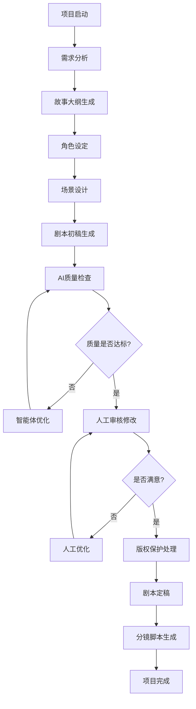
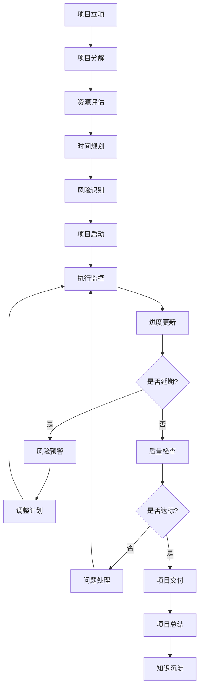
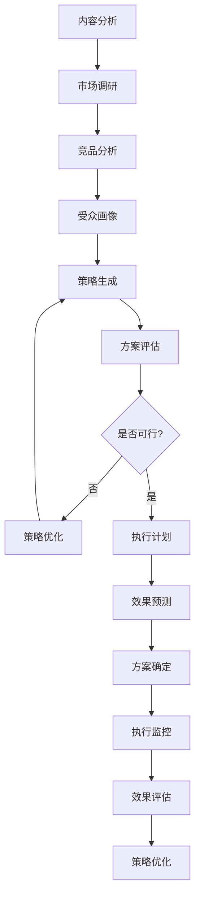
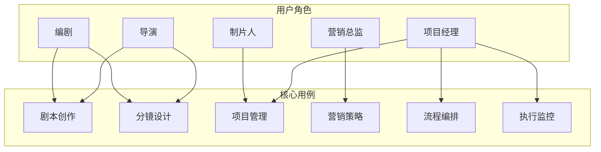

# DramaAgentPro 影视企业智能体SaaS平台产品需求文档(PRD) v2.0

## 1. 项目概述

### 1.1 项目背景
随着国内短视频、网络剧、微电影等影视内容的爆发式增长，影视行业正经历着前所未有的变革。中国影视内容市场规模超过2000亿元，年增长率超过20%，短视频日产量超过1000万条，网络剧年产量超过300部。然而，传统影视制作流程效率低下，成本高昂，难以满足快速迭代需求。

DramaAgentPro是一个专为影视企业打造的企业级智能体SaaS平台，通过AI技术赋能影视内容创作全流程，解决内容创作效率低下、项目管理复杂、营销策略缺乏数据支撑等核心痛点。

### 1.2 项目目标
- **效率革命**：内容创作效率提升3-5倍，制作周期缩短50%
- **成本优化**：人力成本降低40%，制作成本降低30%
- **质量提升**：标准化流程，内容质量稳定可控
- **创新驱动**：AI辅助创意，突破传统制作模式

### 1.3 投资回报分析(ROI)

#### 1.3.1 投资预算
- **开发成本**：1500万元（11个月开发周期）
- **基础设施成本**：300万元/年
- **运营维护成本**：200万元/年
- **总投入**：第一年2000万元

#### 1.3.2 预期收益
- **效率提升收益**：年节省人力成本800万元
- **质量提升收益**：减少返工成本，年节省300万元
- **决策优化收益**：提升项目成功率，年增收500万元
- **总收益**：年收益1600万元

#### 1.3.3 ROI分析
- **投资回收期**：1.25年
- **3年净现值**：2800万元
- **投资回报率**：80%

### 1.4 目标用户
- **影视制作公司**：传统影视公司、网络影视公司、MCN机构
- **广告公司**：创意广告公司、数字营销公司
- **内容创作者**：独立导演、编剧、制作人、短视频创作者
- **企业用户**：需要视频内容的企业、品牌方

## 2. 市场分析

### 2.1 行业痛点
- **内容创作痛点**：创意瓶颈、制作效率低、质量参差、资源浪费
- **项目管理痛点**：进度失控、成本超支、沟通成本高、风险管控难
- **运营推广痛点**：营销策略缺乏数据支撑、用户触达不准确、效果难以量化
- **技术门槛高**：AI技术应用门槛高，中小企业难以承担

### 2.2 竞品分析

#### 2.2.1 国外竞品
- **ScriptBook**：剧本分析工具，但功能单一
- **WriterDuet**：协作编剧工具，缺乏AI辅助
- **Final Draft**：专业编剧软件，但无智能化功能

#### 2.2.2 国内竞品
- **暂无成熟的影视行业AI智能体平台**
- **传统影视制作软件**：功能分散，缺乏集成

#### 2.2.3 差异化优势
- **全流程覆盖**：从创作到发行的完整解决方案
- **AI深度集成**：智能体技术深度融入业务流程
- **企业级定制**：针对影视行业的专业化定制
- **中文优化**：针对中文内容创作优化

### 2.3 市场机会
- **市场规模**：中国影视内容市场规模超过2000亿元，年增长率超过20%
- **技术成熟**：AI、大数据、云计算技术日趋成熟，应用成本降低
- **政策支持**：国家大力支持文化产业发展，数字化转型政策利好
- **用户需求**：影视企业对效率提升和成本控制需求强烈

## 3. 产品定位

### 3.1 产品愿景
成为影视行业领先的智能体SaaS平台，通过AI技术赋能影视内容创作全流程，推动影视产业数字化转型和智能化升级。

### 3.2 产品定位
- **目标市场**：影视制作公司、MCN机构、广告公司、内容创作者
- **产品类型**：企业级SaaS平台
- **核心价值**：效率革命、成本优化、质量提升、创新驱动

### 3.3 成功标准
- **用户活跃度**：日活跃用户数>80%
- **功能使用率**：核心功能使用率>70%
- **用户满意度**：用户满意度评分>4.5/5.0
- **业务效率**：创作效率提升>50%，项目管理效率提升>30%

## 4. 功能需求

### 4.1 核心功能模块

#### 4.1.1 智能体编排平台
**功能描述**：提供可视化的智能体流程设计和编排能力

**主要功能**：
- 拖拽式流程设计器
- 影视行业专用模板库
- 参数配置和验证
- 流程版本控制
- 执行计划预览
- 模板市场和第三方集成

**用户价值**：
- 降低技术门槛，业务人员可直接使用
- 提高流程设计效率3-5倍
- 支持复杂业务流程的自动化

#### 4.1.2 内容创作智能体
**功能描述**：基于AI技术辅助各类内容创作工作

**主要功能**：
- **剧本创作助手**
  - 故事大纲生成
  - 角色设定和对话生成
  - 场景描述和情节推进
  - 剧本格式化和规范检查
  - 版权保护和原创性检测
- **分镜设计助手**
  - 分镜头脚本自动生成
  - 镜头语言建议
  - 场景转换设计
  - 视觉化预览
- **角色设计助手**
  - 人物形象生成
  - 性格特征设定
  - 关系网络构建
  - 成长弧线设计

**用户价值**：
- 大幅提升创作效率，比传统方式快3-5倍
- 提供创意灵感和参考
- 保证内容质量和一致性

#### 4.1.3 项目管理智能体
**功能描述**：智能化项目全生命周期管理

**主要功能**：
- **项目规划**
  - 项目分解结构(WBS)生成
  - 时间线自动规划
  - 资源需求评估
  - 风险评估和应对策略
- **进度监控**
  - 实时进度跟踪
  - 里程碑管理
  - 延期预警和提醒
  - 进度报告自动生成
- **资源调度**
  - 人员分配优化
  - 设备资源管理
  - 预算控制和预警
  - 冲突检测和解决

**用户价值**：
- 提高项目管理效率60%以上
- 降低项目风险40%
- 优化资源配置，利用率提升30%

#### 4.1.4 营销策略智能体
**功能描述**：基于数据分析提供营销和发行策略支持

**主要功能**：
- **市场分析**
  - 竞品分析报告
  - 目标受众画像
  - 市场趋势预测
  - 票房预测模型
- **营销策略**
  - 营销方案生成
  - 渠道选择建议
  - 预算分配优化
  - 效果预测和评估
- **发行策略**
  - 档期选择建议
  - 发行区域规划
  - 价格策略制定
  - 合作伙伴推荐

**用户价值**：
- 提高营销决策准确性40%
- 降低营销成本30%
- 提升市场竞争力

#### 4.1.5 执行引擎
**功能描述**：提供可视化、可中断、可复盘的智能体执行能力

**主要功能**：
- **可视化执行**
  - 实时执行状态展示
  - 流程进度可视化
  - 执行结果展示
  - 异常状态提醒
- **可中断控制**
  - 任务暂停和恢复
  - 断点设置和调试
  - 参数动态调整
  - 执行路径切换
- **可复盘分析**
  - 执行历史记录
  - 性能分析报告
  - 错误日志分析
  - 优化建议生成

**用户价值**：
- 提供透明的执行过程
- 支持灵活的调试和优化
- 便于问题定位和解决

#### 4.1.6 知识管理平台
**功能描述**：构建企业知识库，支持智能检索和应用

**主要功能**：
- **知识库构建**
  - 文档自动分类和标签
  - 知识图谱构建
  - 版本控制和更新
  - 权限管理
- **智能检索**
  - 语义搜索
  - 多模态检索
  - 相关推荐
  - 历史记录
- **知识应用**
  - 智能问答
  - 知识推荐
  - 模板生成
  - 最佳实践分享

**用户价值**：
- 积累和传承企业知识
- 提高知识利用效率
- 支持决策和创作

### 4.2 支撑功能模块

#### 4.2.1 用户权限管理
- 角色定义和权限分配
- 单点登录(SSO)集成
- 操作日志记录
- 安全审计功能

#### 4.2.2 数据管理
- 多模态数据存储
- 数据备份和恢复
- 数据同步和迁移
- 数据质量监控

#### 4.2.3 系统监控
- 性能监控和告警
- 业务指标统计
- 用户行为分析
- 系统健康检查

#### 4.2.4 API接口
- RESTful API设计
- 第三方系统集成
- 数据导入导出
- 移动端支持

## 5. 业务流程设计

### 5.1 剧本创作流程



### 5.2 项目管理流程



### 5.3 营销策略制定流程



## 6. 用例设计

### 6.1 用例图



### 6.2 详细用例

#### 6.2.1 用例1：剧本创作
**用例名称**：智能剧本创作
**参与者**：编剧、导演
**前置条件**：用户已登录系统，项目已创建
**主要流程**：
1. 编剧输入故事主题和基本要求
2. 系统生成故事大纲
3. 编剧审核并修改大纲
4. 系统基于大纲生成角色设定
5. 编剧完善角色信息
6. 系统生成场景列表
7. 编剧选择场景进行详细创作
8. 系统生成场景对话和描述
9. 系统进行AI质量检查和版权检测
10. 编剧审核修改内容
11. 系统进行格式规范检查
12. 生成最终剧本文档

**异常流程**：
- 如果生成内容不符合要求，返回步骤3重新生成
- 如果AI质量检查不通过，返回步骤8重新生成
- 如果系统出现错误，记录错误信息并通知管理员

**后置条件**：剧本创作完成，文档已保存，版权已保护

#### 6.2.2 用例2：项目管理
**用例名称**：智能项目管理
**参与者**：项目经理、制片人
**前置条件**：项目已立项，基本信息已录入
**主要流程**：
1. 项目经理输入项目基本信息
2. 系统自动生成项目分解结构
3. 项目经理审核并调整WBS
4. 系统评估资源需求和时间安排
5. 项目经理确认资源分配
6. 系统生成项目时间线
7. 项目经理设置里程碑和检查点
8. 系统开始执行监控
9. 定期更新项目进度
10. 系统生成进度报告
11. 项目经理处理异常情况
12. 项目完成后进行知识沉淀

**异常流程**：
- 如果项目延期，系统发送预警通知
- 如果资源冲突，系统提供解决方案建议

**后置条件**：项目按计划执行，状态实时更新，知识已沉淀

#### 6.2.3 用例3：营销策略制定
**用例名称**：智能营销策略
**参与者**：营销总监、市场分析师
**前置条件**：内容已制作完成，市场数据已收集
**主要流程**：
1. 营销总监输入内容基本信息
2. 系统分析目标受众特征
3. 系统进行竞品分析
4. 系统生成营销策略建议
5. 营销总监审核策略方案
6. 系统优化策略细节
7. 系统生成执行计划
8. 营销总监确认执行方案
9. 系统监控执行效果
10. 系统生成效果分析报告
11. 基于效果进行策略优化

**异常流程**：
- 如果策略效果不佳，系统提供优化建议
- 如果市场环境变化，系统重新分析并调整策略

**后置条件**：营销策略制定完成，执行计划已确认，效果已评估

## 7. 原型设计

### 7.1 整体布局设计

#### 7.1.1 主界面布局
```
┌─────────────────────────────────────────────────────────────┐
│  Logo    导航菜单                   用户信息    设置    帮助  │
├─────────────────────────────────────────────────────────────┤
│                                                             │
│  ┌─────────────┐  ┌─────────────────────────────────────┐   │
│  │             │  │                                     │   │
│  │   侧边栏    │  │           主工作区                  │   │
│  │             │  │                                     │   │
│  │ - 仪表盘    │  │                                     │   │
│  │ - 项目管理  │  │                                     │   │
│  │ - 内容创作  │  │                                     │   │
│  │ - 营销策略  │  │                                     │   │
│  │ - 智能体编排│  │                                     │   │
│  │ - 知识管理  │  │                                     │   │
│  │ - 系统设置  │  │                                     │   │
│  │             │  │                                     │   │
│  └─────────────┘  └─────────────────────────────────────┘   │
│                                                             │
└─────────────────────────────────────────────────────────────┘
```

#### 7.1.2 响应式设计
- **桌面端**：1200px以上，三栏布局
- **平板端**：768px-1199px，两栏布局
- **移动端**：767px以下，单栏布局

### 7.2 核心页面设计

#### 7.2.1 仪表盘页面
**功能**：展示项目概览、任务状态、系统状态等关键信息

**布局**：
```
┌─────────────────────────────────────────────────────────────┐
│  仪表盘                                                      │
├─────────────────────────────────────────────────────────────┤
│  ┌─────────────┐  ┌─────────────┐  ┌─────────────┐         │
│  │   进行中    │  │   已完成    │  │   待开始    │         │
│  │   项目数    │  │   项目数    │  │   项目数    │         │
│  │     12      │  │     8       │  │     5       │         │
│  └─────────────┘  └─────────────┘  └─────────────┘         │
│                                                             │
│  ┌─────────────────────────────────────────────────────────┐ │
│  │                项目进度甘特图                           │ │
│  │                                                         │ │
│  └─────────────────────────────────────────────────────────┘ │
│                                                             │
│  ┌─────────────┐  ┌─────────────┐                         │
│  │   最近任务  │  │   系统状态  │                         │
│  │             │  │             │                         │
│  └─────────────┘  └─────────────┘                         │
└─────────────────────────────────────────────────────────────┘
```

#### 7.2.2 智能体编排页面
**功能**：提供可视化的智能体流程设计界面

**布局**：
```
┌─────────────────────────────────────────────────────────────┐
│  智能体编排 > 新建流程                                        │
├─────────────────────────────────────────────────────────────┤
│  ┌─────────────┐  ┌─────────────────────────────────────┐   │
│  │             │  │                                     │   │
│  │   组件库    │  │           设计画布                  │   │
│  │             │  │                                     │   │
│  │ - 输入节点  │  │  [开始] → [分析] → [生成] → [结束]  │   │
│  │ - 处理节点  │  │                                     │   │
│  │ - 输出节点  │  │                                     │   │
│  │ - 条件节点  │  │                                     │   │
│  │ - 循环节点  │  │                                     │   │
│  │             │  │                                     │   │
│  └─────────────┘  └─────────────────────────────────────┘   │
│                                                             │
│  ┌─────────────────────────────────────────────────────────┐ │
│  │                属性配置面板                             │ │
│  └─────────────────────────────────────────────────────────┘ │
└─────────────────────────────────────────────────────────────┘
```

#### 7.2.3 剧本创作页面
**功能**：提供剧本创作的完整工作流程

**布局**：
```
┌─────────────────────────────────────────────────────────────┐
│  内容创作 > 剧本创作 > 《新项目》                            │
├─────────────────────────────────────────────────────────────┤
│  ┌─────────────┐  ┌─────────────────────────────────────┐   │
│  │             │  │                                     │   │
│  │   创作步骤  │  │           编辑区域                  │   │
│  │             │  │                                     │   │
│  │ ✓ 故事大纲  │  │  ┌─────────────────────────────────┐ │   │
│  │ ✓ 角色设定  │  │  │                                 │ │   │
│  │ ✓ 场景设计  │  │  │        剧本内容编辑             │ │   │
│  │ ○ 对话生成  │  │  │                                 │ │   │
│  │ ○ 格式检查  │  │  │                                 │ │   │
│  │ ○ 版权保护  │  │  └─────────────────────────────────┘ │   │
│  │             │  │                                     │   │
│  │             │  │  ┌─────────────┐  ┌─────────────┐   │   │
│  │             │  │  │   保存草稿  │  │   生成剧本  │   │   │
│  │             │  │  └─────────────┘  └─────────────┘   │   │
│  └─────────────┘  └─────────────────────────────────────┘   │
└─────────────────────────────────────────────────────────────┘
```

#### 7.2.4 项目管理页面
**功能**：提供项目全生命周期管理界面

**布局**：
```
┌─────────────────────────────────────────────────────────────┐
│  项目管理 > 项目列表                                         │
├─────────────────────────────────────────────────────────────┤
│  ┌─────────────────────────────────────────────────────────┐ │
│  │  搜索: [________]  筛选: [类型▼] [状态▼] [+ 新建项目]   │ │
│  └─────────────────────────────────────────────────────────┘ │
│                                                             │
│  ┌─────────────────────────────────────────────────────────┐ │
│  │  项目名称    类型    状态    进度    负责人    操作      │ │
│  ├─────────────────────────────────────────────────────────┤ │
│  │  《新电影》  电影    进行中   75%    张三    [详情][编辑]│ │
│  │  《新剧集》  剧集    待开始   0%     李四    [详情][编辑]│ │
│  │  《新漫画》  漫画    已完成   100%   王五    [详情][查看]│ │
│  └─────────────────────────────────────────────────────────┘ │
└─────────────────────────────────────────────────────────────┘
```

### 7.3 交互设计

#### 7.3.1 操作流程
1. **登录**：支持SSO单点登录
2. **导航**：左侧菜单导航，支持折叠
3. **搜索**：全局搜索功能，支持智能提示
4. **通知**：实时通知中心，支持消息分类
5. **帮助**：在线帮助文档，支持智能问答

#### 7.3.2 用户体验
- **响应速度**：页面加载时间<2秒
- **操作反馈**：所有操作都有明确的反馈
- **错误处理**：友好的错误提示和恢复建议
- **快捷键**：支持常用操作的快捷键
- **个性化**：支持界面主题和布局自定义

## 8. 非功能性需求

### 8.1 性能需求
- **响应时间**：页面加载时间<2秒，API响应时间<500ms
- **并发用户**：支持1000+并发用户同时使用
- **数据处理**：支持TB级数据存储和处理
- **可用性**：系统可用性99.9%以上

### 8.2 安全需求
- **身份认证**：支持多种认证方式
- **权限控制**：基于角色的访问控制(RBAC)
- **数据加密**：敏感数据加密存储和传输
- **审计日志**：完整的操作审计记录
- **版权保护**：内容版权保护和原创性检测

### 8.3 兼容性需求
- **浏览器兼容**：支持Chrome、Firefox、Safari、Edge
- **设备兼容**：支持PC、平板、手机等设备
- **系统集成**：支持与现有业务系统集成
- **API兼容**：提供标准RESTful API

### 8.4 可扩展性需求
- **模块化设计**：支持功能模块的独立部署和扩展
- **插件机制**：支持第三方插件和扩展
- **多租户**：支持多租户架构
- **国际化**：支持多语言和多地区

## 9. 项目计划

### 9.1 开发阶段
- **第一阶段(3个月)**：核心框架和基础功能
- **第二阶段(3个月)**：智能体编排和内容创作
- **第三阶段(2个月)**：项目管理和营销策略
- **第四阶段(2个月)**：系统优化和测试
- **第五阶段(1个月)**：部署上线和培训

### 9.2 里程碑
- **M1**：系统架构设计完成
- **M2**：核心功能开发完成
- **M3**：智能体功能开发完成
- **M4**：系统集成测试完成
- **M5**：正式上线运行

### 9.3 资源需求
- **开发团队**：15-20人
- **测试团队**：5-8人
- **产品团队**：3-5人
- **运维团队**：3-5人

### 9.4 技术预研计划
- **AI模型预研**：验证大模型在影视创作中的应用效果
- **性能预研**：验证系统在高并发场景下的性能表现
- **集成预研**：验证与现有系统的集成可行性
- **安全预研**：验证数据安全和版权保护方案

## 10. 风险评估

### 10.1 技术风险
- **AI模型稳定性**：大模型API的稳定性和准确性
- **数据安全**：敏感数据的保护和处理
- **系统性能**：大规模并发访问的性能保障
- **技术选型**：技术栈的成熟度和可维护性

**应对策略**：
- 建立AI模型备用方案
- 实施多层次数据安全保护
- 进行充分的性能测试
- 选择成熟稳定的技术栈

### 10.2 业务风险
- **用户接受度**：用户对新系统的接受和适应
- **需求变更**：业务需求的频繁变更
- **竞品压力**：市场竞争和竞品威胁
- **成本控制**：项目成本和ROI控制

**应对策略**：
- 提供充分的用户培训和支持
- 采用敏捷开发，快速响应需求变化
- 建立差异化竞争优势
- 严格控制项目成本和预算

### 10.3 市场风险
- **技术变化**：AI技术的快速发展和变化
- **政策变化**：相关政策的调整和变化
- **经济环境**：宏观经济环境的影响
- **竞争加剧**：市场竞争的加剧

**应对策略**：
- 保持技术前瞻性和灵活性
- 密切关注政策变化
- 建立风险预警机制
- 持续提升产品竞争力

## 11. 成功标准

### 11.1 业务指标
- **用户活跃度**：日活跃用户数>80%
- **功能使用率**：核心功能使用率>70%
- **用户满意度**：用户满意度评分>4.5/5.0
- **业务效率**：创作效率提升>50%，项目管理效率提升>30%

### 11.2 技术指标
- **系统稳定性**：系统可用性>99.9%
- **响应性能**：平均响应时间<1秒
- **错误率**：系统错误率<0.1%
- **数据准确性**：AI生成内容准确率>85%

### 11.3 商业指标
- **成本节约**：运营成本降低>30%
- **收入增长**：项目交付效率提升带来的收入增长
- **市场竞争力**：在行业中的技术领先地位
- **品牌价值**：提升公司技术品牌形象

### 11.4 投资回报指标
- **投资回收期**：<1.5年
- **投资回报率**：>80%
- **净现值**：3年净现值>2000万元
- **内部收益率**：>25%

---

**文档版本**：v2.0  
**创建日期**：2024年12月  
**最后更新**：2024年12月  
**文档状态**：已评审，待确认
